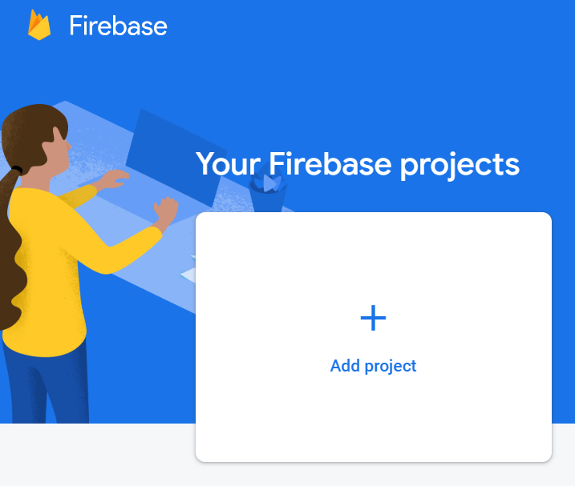
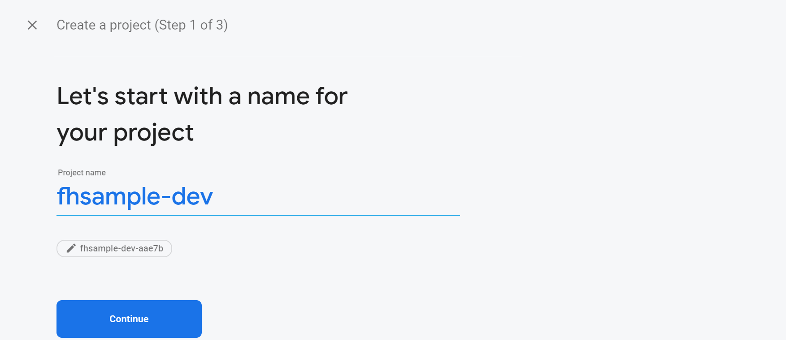
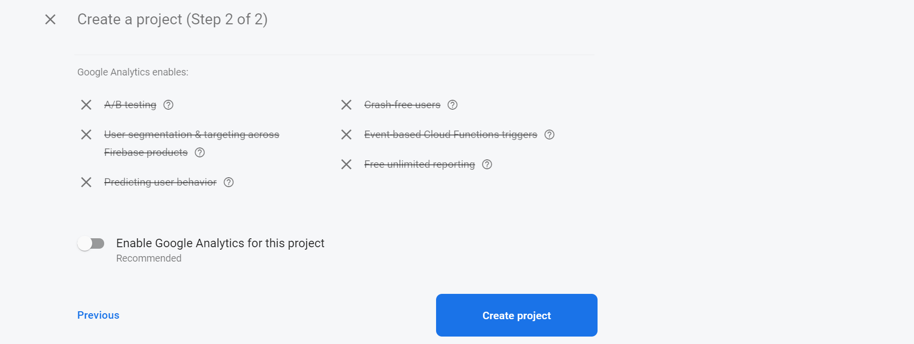
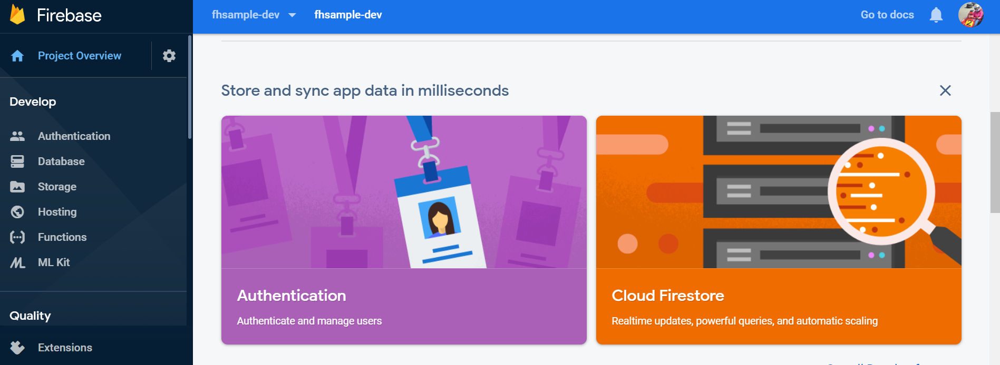

# Schritt1: Projekt Setup

### Firebase Console
Auf google firebase console mit einem Google Acccount wie z.B. ein gmail account einloggen: https://console.firebase.google.com

Nach dem einloggen kann man ein neues Projekt anlegen:

 
 

Als nächstes geben wir dem Projekt einen Namen:

 
 
Wir schalten das Google Analytics aus:
 
 

 
 

Nach dem Click auf Create Projekt wird ein leeres Projekt angelegt. Das Menue auf dem linken Seite hat Zwei Teile: Develop und Quality. Der Develop Teil beinhaltet die haptsaechlichen Diensten Authentication, Database, Storage, Hosting, Function und ML Kit. In diesem Projekt werden nur **Database** unf **Functions** verwendet.

### Development Setup
### Node js -> nvm, npm
### firebase tools
### initialize projekt, deploy first version
