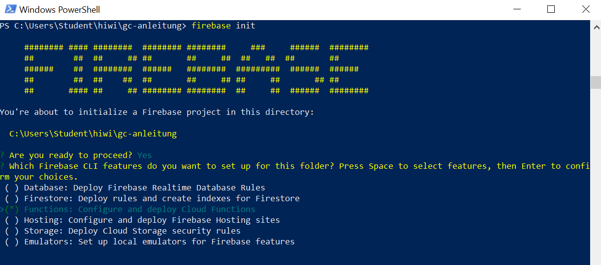
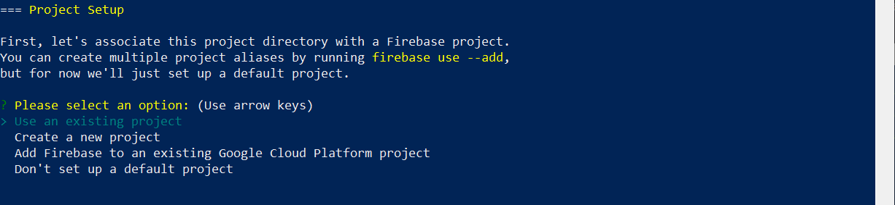
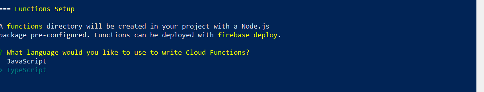

# Schritt1: Projekt Setup

### Firebase Console
Auf google firebase console mit einem Google Acccount wie z.B. einem gmail Account einloggen: https://console.firebase.google.com

Nach dem Einloggen kann man ein neues Projekt anlegen:
<br/>
<br/>

<br/>
<br/>
Als Nächstes geben wir dem Projekt einen Namen:
<br/>
<br/>

<br/>
<br/>
Wir schalten das Google Analytics(Hier brauchen wir das nicht) aus:
<br/>
<br/>

<br/>
<br/>
Nach dem Klick auf Create Projekt wird ein leeres Projekt angelegt. Das Menue auf die linken Seite hat zwei Teile: Develop und Quality. Der Develop Teil beinhaltet die haptsächlichen Diensten Authentication, Database, Storage, Hosting, Function und ML Kit. In diesem Projekt werden nur **Database** und **Functions** verwendet.


## Development Setup
### Installation von Firebase CLI
Die Firebase-Command-Line-Interface ist ein Tool, mit dem Firebase-Projekte und Ausführungsaufgaben über "Command Line" verwaltet werden. Die Firebase-CLI ist auch die Methode, mit der Firebase-Cloud-Funktionen bereitgestellt und deployert werden. Die komplette Dokumentation von Firebase CLI finden Sie hier: https://firebase.google.com/docs/cli

1- Installation von nvm auf windows 10
nvm ist ein Tool, mit dem die unterschiedlichen verionen von Node.js installiert und verwaltet werden kann. Für Windows 10 wurde [nvm-windows](https://github.com/coreybutler/nvm-windows) installiert.

2- Installation von Node.js version 12.9.0
```
nvm install 12.9.0
nvm list
```
3- Nach der erfolgreichen Installation von Node.js, wird firebase-tools als Folgendes installiert:
```
npm install -g firebase-tools
```

4- Login und test
```
firebase login
firebase projects:list
```
<br/>

<br/>
<br/>

### Projekt Initializierung
```
firebase init
```
Wir wählen Cloud **Functions** wie Folgendes aus:
<br/>
<br/>

<br/>
<br/>
Da wir bereits ein Projekt durch Firebase Console angelegt haben, wählen wir die Option "Use an existing projekt" aus:
<br/>
<br/>

<br/>
<br/>

Da wir unsere Funktionen mit TypeScript implementieren wollen, wählen wir **Typescript** als Programiersprache aus:
<br/>
<br/>

<br/>
<br/>

Die Struktur des angelegten Projekts wird wie hier aussehen: [src](https://github.com/fmzadeh/gc-anleitung/tree/393bdbfd660ac8e261fbd6d2e530ac3ac170c43c/src)
