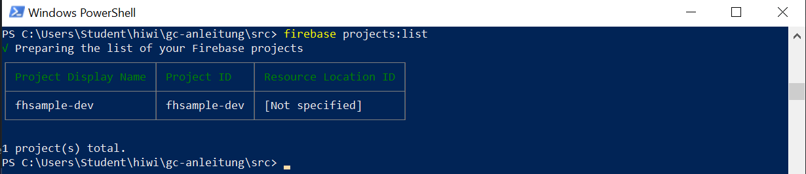

# Schritt1: Projekt Setup

### Firebase Console
Auf google firebase console mit einem Google Acccount wie z.B. ein gmail account einloggen: https://console.firebase.google.com

Nach dem einloggen kann man ein neues Projekt anlegen:
<br/>
<br/>

<br/>
<br/>
Als nächstes geben wir dem Projekt einen Namen:
<br/>
<br/>

<br/>
<br/>
Wir schalten das Google Analytics aus:
<br/>
<br/>

<br/>
<br/>
Nach dem Click auf Create Projekt wird ein leeres Projekt angelegt. Das Menue auf dem linken Seite hat Zwei Teile: Develop und Quality. Der Develop Teil beinhaltet die haptsaechlichen Diensten Authentication, Database, Storage, Hosting, Function und ML Kit. In diesem Projekt werden nur **Database** unf **Functions** verwendet.


## Development Setup
### Installation vom Firebase CLI
Die Firebase-Command-Line-Interface ist ein Tool, mit dem Firebase-Projekte und Ausführungsaufgaben über "Command Line" verwaltet werden. Die Firebase-CLI ist auch die Methode, mit der Firebase-Cloud-Funktionen bereitgestellt und deployert werden. Die komplette Dokumentation von Firebase CLI finden Sie hier: https://firebase.google.com/docs/cli

1- Installation vom nvm auf windows 10
nvm ist ein Tool damit unterschiedliche verionen von Node Js installiert und verwaltet werden kann. Füer Windows 10 wurde [nvm-windows](https://github.com/coreybutler/nvm-windows) installiert.

2- Installation vom nodejs version 12.9.0
```
nvm install 12.9.0
nvm list
```
3- Nach der erfolgreichen Installation vom Node js, wird firebase-tools als folgendes installiert:
```
npm install -g firebase-tools
```

4- Login und test
```
firebase login
firebase projects:list
```
<br/>

<br/>
<br/>

### Node js -> nvm, npm
### firebase tools
### initialize projekt, deploy first version
