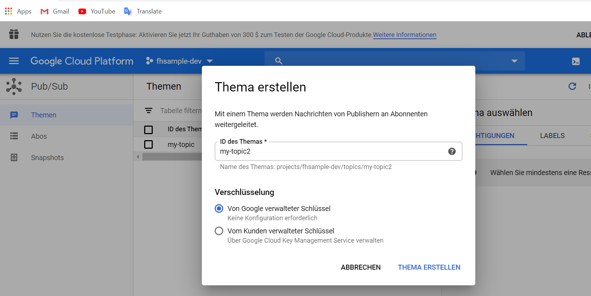

### Schritt 3: Nachrichten durch  Pub/Sub
Cloud Pub/Sub bringt die Flexibilität und Zuverlässigkeit von nachrichtenorientierter Middleware in die Cloud. Durch asynchrones n:n-Messaging, das Absender und Empfänger entkoppelt, ermöglicht es eine sichere und hochverfügbare Kommunikation zwischen unabhängig entwickelten Anwendungen. Cloud Pub/Sub ist ein beständiger Nachrichtendienst mit niedriger Latenz, der Entwicklern die schnelle Integration von auf der Google Cloud Platform oder extern gehosteten Systemen ermöglicht.
Before wir in einem Topic schreiben, muessen wir durch Google Cloud Console einen Topic mit dem gleichen Namen erstellen, wir z.B my-topic:
<br/>
<br/>

<br/>
<br/>
In diesem Schritt werden drei Funktionen implementiert.
- **/publisher**: Dieser API bekommt einen Text als Eingabe und schreibt ihn als eine Nachricht in den Topic testtopic ins Pub/Sub System.
```
export const publisher = functions.https.onRequest(async (request, response) => {
  const path = request.path;
  if(!path) {
    response.status(400).send("Keine Daten");
  } else {
    const topicName = 'my-topic';
    const data = JSON.stringify({ nachricht: path });
    const dataBuffer = Buffer.from(data);

    const messageId = await pubsub.topic(topicName).publish(dataBuffer);

    console.log(`Message ${messageId} published.`);
    response.send('OK');
  }
});
```
- **subscriber**: subscribiert sich an testtopic, bekommt die Nachrichten und schribt sie in die datenbank.
```
exports.subscriber = functions.pubsub.topic('my-topic').onPublish(async (message) => {
    console.log(`Message ${message.json.nachricht} received.`);
    const docRef = db.collection('nachrichten').doc();
    await docRef.set({
      nachricht: message.json.nachricht,
      datetime: Date.now()
    });
    return;
});
```
- **/processed** API: Gibt alle bearbeiteten Nachrichten zurück.
```
export const processed = functions.https.onRequest(async (request, response) => {
  const historiesRef = db.collection('nachrichten').orderBy('datetime', 'desc').limit(10);
  const allHistories = await historiesRef.get()
    .then(snapshot => {
      let allDocs: any[] = [];
      snapshot.forEach(doc => {
        const h = {
          nachricht: doc.data()['nachricht'],
          date: new Date(doc.data()['datetime'])
        }
        allDocs.push(h);
      });
      return allDocs;
    })
    .catch(err => {
      console.log('Error getting documents', err);
    });
    response.send(allHistories );
});
```
